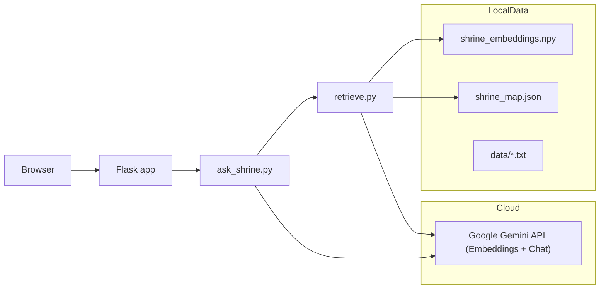

# The Shrine - Retrieval-Augmented Q&A Prototype (Flask)

**Short summary**
This repository is a small, focused prototype that combines a Flask web app, a local embedding + FAISS retrieval layer, and a generative model (Google Gemini) to answer user questions from a small local document set. It is intentionally a prototype - suitable for demos and learning. Production hardening is listed in the **Production notes** section.

---

## Tech stack (quick)

- Python 3.9+ (recommended)
- Flask - web server and templates
- Google Gen AI SDK (`google-genai`) - used for BOTH embeddings and generation
- numpy - arrays and .npy storage for vector search
- python-dotenv - local env vars

---

## Update (v2.0 Refactor)

I had to change how the "memory" works because of deployment limits.

Originally, this project used `sentence-transformers` (local PyTorch model) and `FAISS` to handle the search. It worked great on my laptop, but when I tried to deploy it to the free tier of PythonAnywhere, it crashed because the disk quota is only 512 MB. The PyTorch libraries alone were nearly 900 MB.

To fix this, I refactored the architecture:

1. **Removed heavy libraries:** Deleted `torch`, `sentence-transformers`, and `faiss`.
2. **Cloud Embeddings:** Switched to `google-genai` to generate embeddings in the cloud instead of calculating them locally.
3. **NumPy Search:** Since I only have a small number of text files, I replaced FAISS with standard NumPy dot-product math. It is lightweight and fast enough for this scale.

Now the whole app fits easily within the free tier limits.

## Repo layout (important files)

- `app.py` - Flask application and all HTTP routes (`/`, `/sell`, `/ask`, etc.).
- `the_shrine.py` - `Shrine` class: OOP business logic (inventory, persistence, actions).
- `ask_shrine.py` - orchestration: retrieve context → assemble prompt → call Gemini.
- `retrieve.py` - FAISS index loader and `search_context(query)` function.
- `create_embeddings.py` - create embeddings from `data/*.txt` and write `shrine_embeddings.npy` + `shrine_map.json`.
- `templates/` - `index.html`, `about.html` and Jinja2 templates.
- `static/` - CSS, JS, and media assets.
- `data/` - text documents used for retrieval (e.g., `lore_asan.txt`, `caretaker_rules.txt`, ...).
- `.env` (not committed) - store `GOOGLE_API_KEY` here.

---

## Prerequisites

1. Python 3.9 or newer installed.
2. Virtual environment recommended.
3. Internet access for model downloads and the Google Generative AI API (if using the `ask` flow).
4. A valid Google Generative AI API key for `ask_shrine.py` (put in `.env` as `GOOGLE_API_KEY`).

---

## How to run locally (step-by-step)

Open a terminal in the project root and follow these commands exactly.

### 1) Create and activate a virtual environment

```bash
python -m venv venv
# macOS / Linux
source venv/bin/activate
# Windows (PowerShell)
venv\Scripts\Activate.ps1
```

### 2) Install dependencies

```bash
pip install --upgrade pip
pip install -r requirements.txt
```

### 3) Prepare environment variables

Create a `.env` file in the project root with the following line:
`GOOGLE_API_KEY=your_real_google_generative_api_key_here`
Do not commit `.env` to source control.

### 4) Create embeddings (one-time step after you add `data/*.txt`)

```bash
python create_embeddings.py
```

- This reads the files listed in `create_embeddings.py` (the `data` folder).
- It writes `shrine_embeddings.npy` and `shrine_map.json`.
- If no documents exist, the script warns and exits.

### 5) (Optional) Test retrieval locally

```bash
python retrieve.py
```

- This runs a simple interactive loop. Type a question to see which document is retrieved.

### 6) Run the Flask app

```bash
python app.py
```

- By default it runs in debug mode on `http://127.0.0.1:5000`.
- Open the URL in your browser and try the chat box ("Ask the Spirits"). The `/ask` endpoint runs retrieval + Gemini generation.


